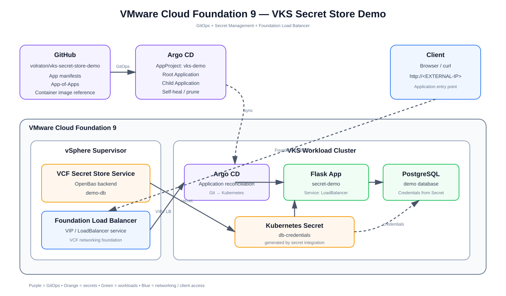

# VKS Secret Store Demo

A practical VMware Cloud Foundation 9 / VKS lab covering **Secret Store, GitOps, Argo CD App-of-Apps, PostgreSQL, Flask, and VCF Foundation Load Balancer services**.



## What this demo covers

- VMware Cloud Foundation 9.x
- vSphere Supervisor
- VCF Secret Store Service / OpenBao as the secret system of record
- VKS workload cluster
- Argo CD GitOps
- Argo CD AppProject
- Argo CD App-of-Apps
- External Secrets synchronization pattern
- Flask sample application
- PostgreSQL
- VCF Foundation Load Balancer / Kubernetes `Service type: LoadBalancer`
- Secret rotation
- GitOps application updates
- A non-GitOps deployment path using `kubectl`

> **Lab scope:** version-specific Secret Store and load-balancer integration objects must match the VCF/VKS release actually installed in the environment. The repository intentionally avoids hard-coding provider-specific annotations that may differ between releases.

## Demo credential

For this lab only:

```text
Username: demo
Password: VMware123!
```

> This repository is public. `VMware123!` is intentionally a disposable lab password. Never use it in production.

## Architecture

The block diagram above is the primary architecture view. The logical flow is:

```text
GitHub
  |
  v
Argo CD App-of-Apps
  |
  v
VKS
  +-------------------+
  | Flask              |<------ VCF Foundation Load Balancer / VIP
  | PostgreSQL         |
  | ExternalSecret     |
  +---------+----------+
            ^
            |
      VCF Secret Store
            |
         OpenBao
```

### Separation of responsibilities

```text
GitHub / Argo CD
    |
    +-- application manifests
    +-- image reference
    +-- Kubernetes configuration
    +-- Argo CD application hierarchy

VCF Secret Store Service
    |
    +-- database username
    +-- database password
    +-- secret lifecycle

VCF Foundation Load Balancer
    |
    +-- external VIP / load-balancer service
    +-- client access to the application

VKS
    |
    +-- Flask workload
    +-- PostgreSQL workload
    +-- Kubernetes Secret generated by secret integration
```

The database password is **not** stored in Git.

---

# Repository layout

```text
vks-secret-store-demo/
|
+-- app/
|   +-- app.py
|   +-- requirements.txt
|   +-- Dockerfile
|
+-- docs/
|   +-- architecture.svg
|
+-- k8s/
|   +-- namespace.yaml
|   +-- external-secret.yaml
|   +-- postgres.yaml
|   +-- app.yaml
|   +-- loadbalancer.yaml
|
+-- argocd/
|   +-- project.yaml
|   +-- root/
|   |   +-- application.yaml
|   +-- apps/
|       +-- demo.yaml
|
+-- secret-store/
|   +-- README.md
|
+-- .github/
    +-- workflows/
        +-- build.yml
```

---

# Prerequisites

You need:

- VMware Cloud Foundation 9.x
- vSphere Supervisor enabled
- A vSphere Namespace with suitable storage/network configuration
- VCF Secret Store Service enabled for the namespace
- A VKS workload cluster
- Argo CD available in the VKS cluster for the GitOps path
- The VKS Secret Store / external-secret integration appropriate to your installed release
- VCF Foundation load-balancer capability configured for the Supervisor/VKS environment
- A container registry reachable by VKS nodes
- `kubectl` and the VMware `kubectl-vsphere` plugin

For exact Secret Store, VKS, and load-balancer versions, use the VCF interoperability matrix and the versions displayed in your environment. Do not mix manifests from another VCF/VKS release.

---

# 1. Verify the Supervisor

Login to the Supervisor:

```bash
kubectl vsphere login \
  --server <SUPERVISOR-IP> \
  --vsphere-username administrator@vsphere.local \
  --insecure-skip-tls-verify
```

Check the context:

```bash
kubectl config get-contexts
kubectl config current-context
kubectl get namespaces
```

Check Secret Store and load-balancer related components:

```bash
kubectl get pods -A | grep -Ei 'secret|bao|load|lb|avi'
kubectl get svc -A | grep -Ei 'secret|load|lb|avi'
kubectl get crd | grep -Ei 'secret|external|load'
```

Object names are release dependent.

---

# 2. Install or enable VCF Secret Store Service

In the vSphere Client, use the Supervisor Services area and install/enable the **Secret Store Service** version compatible with the VCF 9 environment.

Conceptually:

```text
vSphere Client
  -> Workload Management
  -> Supervisor
  -> Services
  -> Secret Store Service
```

If the service is already installed, verify that it is healthy instead of reinstalling it.

If the service requires a `values.yaml`, use the storage class/storage policy from your own Supervisor environment:

```bash
kubectl get storageclass
```

Do not assume a storage class name from another environment.

---

# 3. Prepare VCF Foundation Load Balancer services

The VKS application is exposed using the Kubernetes service API:

```yaml
spec:
  type: LoadBalancer
```

The actual external VIP/load-balancer implementation is supplied by the VCF foundation networking/load-balancer capability configured for the Supervisor environment. This repository does **not** deploy another load balancer inside VKS.

Before testing the application, verify that the Supervisor/VKS environment has a working load-balancer service and an IP address pool/VIP configuration appropriate for your environment.

The sample service is:

```text
Service: secret-demo-lb
Type: LoadBalancer
Port: 80
Target: secret-demo:8080
```

After deployment check:

```bash
kubectl get svc -n demo secret-demo-lb
```

Expected shape:

```text
NAME             TYPE           CLUSTER-IP     EXTERNAL-IP
secret-demo-lb   LoadBalancer   10.x.x.x       <VIP>
```

The exact VIP depends on the VCF foundation load-balancer configuration.

> Do not add a hard-coded NSX Advanced Load Balancer/Avi annotation unless your installed VCF/VKS release specifically requires it. A standard `type: LoadBalancer` service is the portable Kubernetes contract used by this sample.

---

# 4. Create the vSphere Namespace

Create a namespace for the demo, for example:

```text
Namespace: demo
```

Assign the required:

- Storage policy
- Network
- Load-balancer/network configuration
- Permissions
- Resource limits/quotas as appropriate

Enable the Secret Store Service for the namespace according to the VCF 9 UI/API exposed by your installed service version.

---

# 5. Create the remote secret

Create a logical secret in the VCF Secret Store Service:

```text
Name: demo-db

username = demo
password = VMware123!
```

The value lives in the VCF Secret Store, not in Git.

The expected logical secret name used by this repository is:

```text
demo-db
```

Verify that the identity used by the workload integration has permission to read it.

---

# 6. Verify Secret Store before deploying workloads

Do this before deploying the application.

Check the Supervisor service health and verify that the `demo-db` secret can be accessed through the supported VCF Secret Store interface.

If the Secret Store is not healthy, stop and fix it before continuing.

Troubleshooting boundaries:

```text
Secret Store problem     -> fix Supervisor
Load Balancer problem    -> fix VCF foundation networking/LB
VKS problem              -> fix VKS/add-on
Argo CD problem          -> fix GitOps
Application problem      -> fix Flask/PostgreSQL
```

---

# 7. Create the VKS workload cluster

Create a VKS cluster in the vSphere Namespace using a VKS release compatible with the VCF 9 environment.

Example lab name:

```text
vks-demo
```

Login:

```bash
kubectl vsphere login \
  --server <SUPERVISOR-IP> \
  --vsphere-username administrator@vsphere.local \
  --tanzu-kubernetes-cluster vks-demo \
  --tanzu-kubernetes-cluster-namespace demo \
  --insecure-skip-tls-verify
```

Verify:

```bash
kubectl config current-context
kubectl get nodes
```

---

# 8. Verify the VKS Secret Store integration

Discover what is actually installed:

```bash
kubectl get crd | grep -Ei 'secret|external'
kubectl get pods -A | grep -Ei 'secret|external'
kubectl get addon -A | grep -i secret
kubectl get addonrelease -A | grep -i secret
```

If External Secrets Operator is part of the selected integration:

```bash
kubectl get pods -A | grep -i external-secrets
kubectl get crd | grep external-secrets
```

The repository expects the Kubernetes-side store to be represented as:

```text
ClusterSecretStore/vcf-secret-store
```

and the remote secret as:

```text
demo-db
```

**Important:** `ClusterSecretStore/vcf-secret-store` is an integration contract used by this sample. Its provider configuration depends on the Secret Store integration exposed by the installed VCF/VKS release.

Do not replace this with a generic HashiCorp Vault Helm deployment unless that is explicitly what you intend to demo.

---

# 9. Build the application image

The GitHub Actions workflow builds and publishes:

```text
ghcr.io/volraton/vks-secret-store-demo:latest
ghcr.io/volraton/vks-secret-store-demo:<commit-sha>
```

If GHCR is private, configure an image pull secret in VKS or make the demo package public for a lab.

---

# 10. GitOps path: Argo CD App-of-Apps

This repository uses **App-of-Apps** rather than one large Argo CD Application.

```text
Argo CD
   |
   v
vks-secret-store-demo-root
   |
   v
argocd/apps/
   |
   +---- vks-secret-store-demo
             |
             v
           k8s/
```

The AppProject is:

```text
vks-demo
```

The bootstrap order is intentional.

## 10.1 Create the AppProject first

From a kubeconfig context pointing to the VKS cluster:

```bash
kubectl apply -f argocd/project.yaml
```

Verify:

```bash
kubectl get appproject -n argocd vks-demo
```

## 10.2 Create the root Application

```bash
kubectl apply -f argocd/root/application.yaml
```

Verify:

```bash
kubectl get applications -n argocd
```

The root Application reads:

```text
argocd/apps
```

and creates the child Application.

## 10.3 Verify the child Application

```bash
kubectl get applications -n argocd
kubectl describe application vks-secret-store-demo -n argocd
```

Expected state:

```text
vks-secret-store-demo   Synced   Healthy
```

---

# 11. What the App-of-Apps deploys

The child Application synchronizes the `k8s/` directory:

```text
namespace
  |
  +-- ExternalSecret
  |
  +-- PostgreSQL
  |
  +-- Flask
  |
  +-- ClusterIP service
  |
  +-- LoadBalancer service
```

The load-balancer service is:

```text
secret-demo-lb
```

and is deliberately separate from the internal `secret-demo` ClusterIP service.

---

# 12. Verify secret synchronization

```bash
kubectl get externalsecret -n demo
kubectl describe externalsecret db-credentials -n demo
kubectl get secret db-credentials -n demo
```

Expected flow:

```text
VCF Secret Store
      |
      | demo-db
      v
ClusterSecretStore
      |
      v
ExternalSecret
      |
      v
Kubernetes Secret
  db-credentials
```

Do not print decoded secret values in a shared terminal or presentation.

---

# 13. Verify PostgreSQL and Flask

```bash
kubectl get pods -n demo
kubectl get svc -n demo
kubectl logs deployment/postgres -n demo
kubectl logs deployment/secret-demo -n demo
```

PostgreSQL reads `db-credentials` and Flask uses the same credentials to connect to:

```text
postgres:5432
```

---

# 14. Test through the VCF Foundation Load Balancer

Get the VIP:

```bash
kubectl get svc -n demo secret-demo-lb -o wide
```

Or:

```bash
kubectl get svc -n demo secret-demo-lb -o jsonpath='{.status.loadBalancer.ingress[0].ip}{"\n"}'
```

If the environment returns a hostname instead of an IP:

```bash
kubectl get svc -n demo secret-demo-lb -o jsonpath='{.status.loadBalancer.ingress[0].hostname}{"\n"}'
```

Test:

```bash
curl http://<EXTERNAL-IP>/
```

Or open:

```text
http://<EXTERNAL-IP>/
```

Expected page:

```text
VMware VKS Secret Store Demo

Application : Flask
Database    : PostgreSQL

DB User     : demo
DB Password : ********

Connection  : SUCCESS

Secret Source: VCF Secret Store Service
GitOps       : Argo CD
Runtime      : VMware VKS
```

The path is:

```text
Client
  |
  v
VCF Foundation Load Balancer / VIP
  |
  v
VKS Service: secret-demo-lb
  |
  v
Flask Pods
  |
  v
PostgreSQL
```

---

# 15. Non-GitOps path

Argo CD is optional for this demo. The same workload can be deployed manually with `kubectl` while continuing to use VCF Secret Store for credentials.

```text
VCF Secret Store
       |
       v
ExternalSecret integration
       |
       v
kubectl apply
       |
       v
VKS
```

From the VKS kubeconfig context:

```bash
kubectl apply -f k8s/namespace.yaml
kubectl apply -f k8s/external-secret.yaml
kubectl apply -f k8s/postgres.yaml
kubectl apply -f k8s/app.yaml
kubectl apply -f k8s/loadbalancer.yaml
```

Verify:

```bash
kubectl get pods -n demo
kubectl get externalsecret -n demo
kubectl get secret -n demo db-credentials
kubectl get svc -n demo
```

Then obtain the Foundation Load Balancer VIP:

```bash
kubectl get svc -n demo secret-demo-lb -o wide
```

This path has:

| Capability | GitOps | Non-GitOps |
|---|---|---|
| VKS | Yes | Yes |
| VCF Secret Store | Yes | Yes |
| Foundation Load Balancer | Yes | Yes |
| Argo CD | Yes | No |
| Git as deployment source | Yes | No |
| Self-healing | Yes | No |
| Best for | Production/GitOps demo | Lab/troubleshooting |

The important design point is that **GitOps and Secret Management are separate concerns**. The password remains in VCF Secret Store in both deployment modes.

---

# 16. Test GitOps application updates

Change a harmless application or manifest value, commit, and push:

```bash
git add .
git commit -m "Update demo application"
git push origin main
```

The flow is:

```text
Developer
   |
   v
GitHub
   |
   v
GitHub Actions
   |
   v
GHCR
   |
   v
Argo CD root Application
   |
   v
Child Application
   |
   v
VKS
   |
   v
Foundation Load Balancer
```

Check:

```bash
kubectl get applications -n argocd
kubectl -n demo rollout status deployment/secret-demo
kubectl get svc -n demo secret-demo-lb
```

The application VIP remains the Kubernetes Service endpoint while the workload version changes underneath it.

---

# 17. Test secret rotation

Change the password in VCF Secret Store Service from:

```text
VMware123!
```

to a new lab value, for example:

```text
VMware456!
```

Do **not** edit Git.

Wait for the configured synchronization interval and check:

```bash
kubectl get externalsecret -n demo
kubectl describe externalsecret db-credentials -n demo
kubectl get secret db-credentials -n demo
```

Because this sample consumes the generated Secret as environment variables, restart the workloads after the Secret object is updated:

```bash
kubectl -n demo rollout restart deployment/postgres
kubectl -n demo rollout restart deployment/secret-demo
kubectl -n demo rollout status deployment/postgres
kubectl -n demo rollout status deployment/secret-demo
```

Then refresh the application through the **same Load Balancer VIP**.

The demonstration is:

```text
Password changed
      |
      v
VCF Secret Store
      |
      v
ExternalSecret sync
      |
      v
Kubernetes Secret
      |
      v
Workload restart
      |
      v
Same Foundation LB VIP
      |
      v
Application reconnects
```

Git was not changed.

---

# 18. Troubleshooting

## LoadBalancer has no external IP

```bash
kubectl get svc -n demo secret-demo-lb -o wide
kubectl describe svc secret-demo-lb -n demo
kubectl get events -n demo --sort-by=.lastTimestamp
```

If `EXTERNAL-IP` remains `<pending>`, check the VCF Supervisor/foundation load-balancer configuration, IP/VIP pool, network permissions, and the VKS/Supervisor load-balancer integration.

Do not troubleshoot Flask first when the Service has no VIP.

## LoadBalancer has a VIP but the application is unreachable

```bash
kubectl get endpoints secret-demo-lb -n demo
kubectl get pods -n demo -o wide
kubectl describe svc secret-demo-lb -n demo
```

Verify the selector:

```text
app=secret-demo
```

and that the Flask Pods are Ready.

## Argo CD is OutOfSync

```bash
kubectl get applications -n argocd
kubectl describe application vks-secret-store-demo -n argocd
```

Check that Argo CD can reach:

```text
https://github.com/volraton/vks-secret-store-demo.git
```

## ExternalSecret is not Ready

```bash
kubectl describe externalsecret db-credentials -n demo
kubectl get events -n demo --sort-by=.lastTimestamp
kubectl get crd | grep -Ei 'external|secret'
kubectl get pods -A | grep -Ei 'external|secret'
```

Most commonly this indicates that `ClusterSecretStore/vcf-secret-store` has not been created or its provider configuration does not match the installed VCF/VKS Secret Store integration.

## PostgreSQL is not Ready

```bash
kubectl get pods -n demo
kubectl describe pod -l app=postgres -n demo
kubectl logs deployment/postgres -n demo
```

Check that `db-credentials` exists before debugging PostgreSQL itself.

## Flask cannot connect to PostgreSQL

```bash
kubectl logs deployment/secret-demo -n demo
kubectl get svc postgres -n demo
kubectl get endpoints postgres -n demo
```

Verify PostgreSQL is Ready first.

## Secret rotation does not affect the running application

This is expected when the secret is injected into environment variables. Updating the Kubernetes Secret does not change the environment of an already-running process. Restart the workloads after rotation as shown above.

---

# 19. Security notes

- `VMware123!` is a disposable lab credential only.
- Never use it in production.
- Never commit real credentials to Git.
- Do not put real credentials in Docker image layers.
- Do not put real credentials in Helm values or plain Kubernetes manifests.
- Keep the VCF Secret Store as the system of record for sensitive values.
- Restrict the Argo CD AppProject to the required repository, namespaces, and resource types.
- Use TLS and proper certificates for production application access.
- Use the VCF/VKS-supported load-balancer integration for production rather than adding an unrelated load-balancer implementation inside the cluster.

---

# 20. Demo checklist

```text
[ ] VCF 9 Supervisor healthy
[ ] Secret Store Service healthy
[ ] Foundation Load Balancer capability healthy
[ ] demo-db exists in VCF Secret Store
[ ] VKS cluster healthy
[ ] VKS Secret Store integration healthy
[ ] Argo CD healthy
[ ] AppProject created
[ ] Root Application synced
[ ] Child Application synced
[ ] ExternalSecret Ready
[ ] db-credentials generated
[ ] PostgreSQL Ready
[ ] Flask Ready
[ ] secret-demo-lb has EXTERNAL-IP
[ ] Application reachable through Foundation Load Balancer
[ ] GitOps update tested
[ ] Secret rotation tested
[ ] Non-GitOps deployment path tested
```

---

## Reference

Use the Broadcom VCF 9 documentation for the exact Secret Store Service and Supervisor/VKS integration objects for the release installed in your environment.
