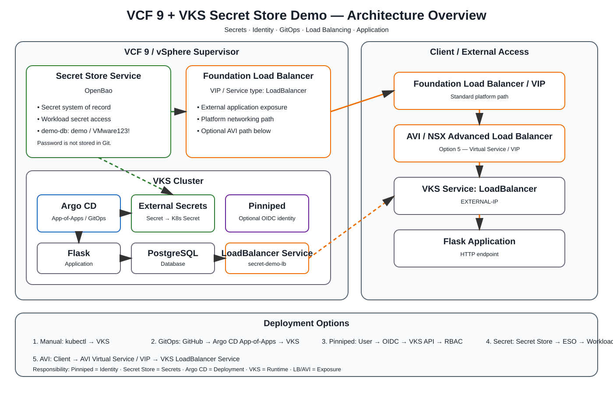
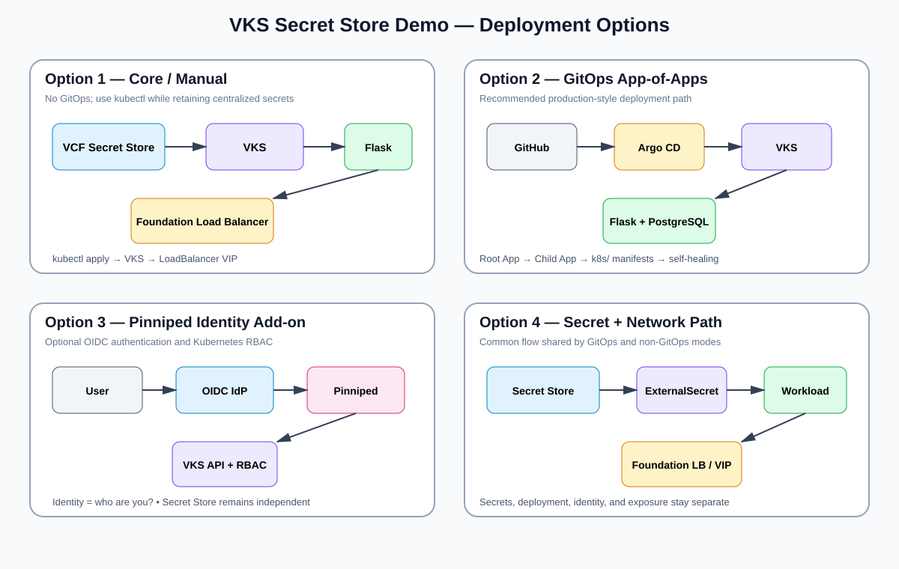
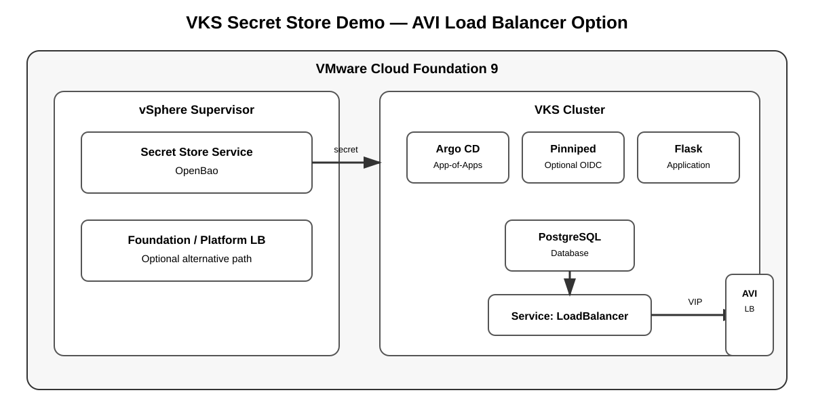

# Deployment Options





The demo is intentionally modular. Choose the deployment model that matches the lab objective.

## Option 1 — Core / Manual

```text
kubectl → VKS → Flask/PostgreSQL
              ↑
       VCF Secret Store
              │
       Foundation LB / VIP
```

Use this for a simple lab or troubleshooting session. Argo CD is not required.

## Option 2 — GitOps App-of-Apps

```text
GitHub → Argo CD Root App → Child App → VKS
                                      │
                                      └→ Flask/PostgreSQL
```

Use this for the recommended production-style demonstration. The AppProject controls repository and destination boundaries, while the App-of-Apps pattern manages child applications.

## Option 3 — Pinniped Identity

```text
User → OIDC IdP → Pinniped → VKS API → Kubernetes RBAC
```

Optional identity/authentication layer. It demonstrates who the user is and what Kubernetes resources the user can access. It does not replace Secret Store Service.

See `../addons/pinniped/README.md`.

## Option 4 — Shared Secret + Foundation Network Path

Both GitOps and non-GitOps modes use the same runtime pattern:

```text
VCF Secret Store → ExternalSecret → Kubernetes workload
                                          │
                                          ▼
                              Foundation Load Balancer
                                          │
                                          ▼
                                         Client
```

This makes the architecture easy to explain:

| Concern | Component |
|---|---|
| Identity | Pinniped / OIDC |
| Secrets | VCF Secret Store / OpenBao |
| Deployment | Argo CD or kubectl |
| Runtime | VKS |
| Exposure | VCF Foundation Load Balancer |
| Application | Flask + PostgreSQL |

## Option 5 — AVI / NSX Advanced Load Balancer

Use AVI Load Balancer / NSX Advanced Load Balancer as the external load-balancing implementation while keeping the Kubernetes `Service type: LoadBalancer` contract.



```text
Client
  │
  ▼
AVI Load Balancer / NSX Advanced Load Balancer
  │
  │ Virtual Service / VIP
  ▼
VKS Service: LoadBalancer
  │
  ▼
Flask
  │
  ▼
PostgreSQL
```

This option is useful when the workshop needs to demonstrate:

- AVI/NSX Advanced Load Balancer integration
- Virtual Service / VIP
- Kubernetes `Service type: LoadBalancer`
- External application traffic management
- Separation between Kubernetes service intent and the LB implementation

The application and VCF Secret Store flow do not need to change.

> **Version note:** AVI/NSX ALB annotations, controller objects, IPAM, cloud configuration, and service-engine behavior are release/environment dependent. Do not hard-code an annotation from another VKS/VCF release. Use the integration supported by the installed version.

See `avi-lb/README.md` for the detailed option and troubleshooting flow.

## Foundation LB vs AVI

| | Foundation Load Balancer | AVI / NSX Advanced Load Balancer |
|---|---|---|
| Kubernetes API | `Service: LoadBalancer` | `Service: LoadBalancer` |
| External endpoint | Foundation/platform VIP | AVI Virtual Service / VIP |
| Main purpose | Standard VCF platform exposure | Advanced LB integration demo |
| Application changes | None | None |
| Secret Store changes | None | None |

## Recommended demo sequence

1. Start with Option 1.
2. Add Option 2 to demonstrate GitOps.
3. Add Option 3 if identity/SSO is part of the workshop.
4. Use Option 4 to explain the separation of secrets and network exposure.
5. Add Option 5 when the environment includes AVI/NSX Advanced Load Balancer and you want to demonstrate the alternate LB implementation.
