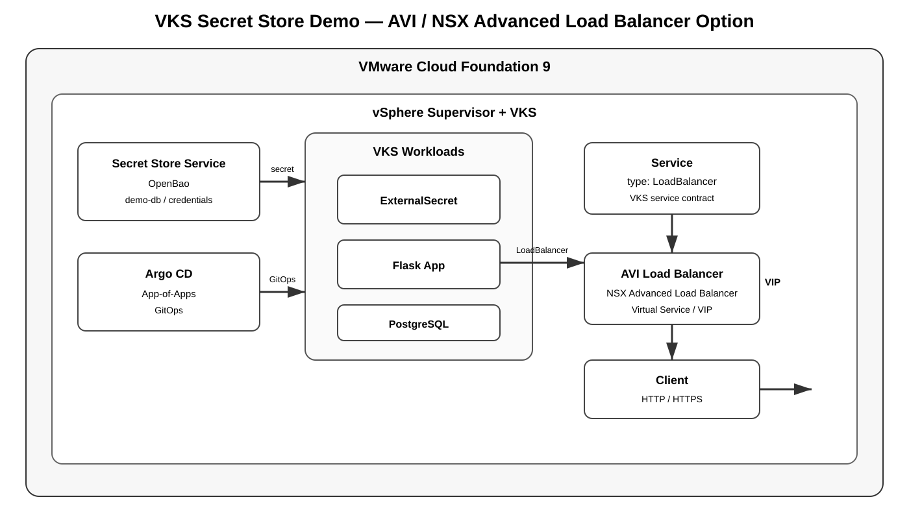

# Option: AVI Load Balancer Integration

This option demonstrates using **VMware AVI Load Balancer / NSX Advanced Load Balancer** as the external load-balancing integration for the VKS application.



It is an optional networking path. The core demo continues to use the Kubernetes `Service` abstraction with `type: LoadBalancer`.

## Architecture

```text
Client
  |
  v
AVI Load Balancer / NSX Advanced Load Balancer
  |
  |  Virtual Service / VIP
  v
VKS LoadBalancer Service
  |
  v
Flask Pods
  |
  v
PostgreSQL
```

## With the complete VCF 9 demo

```text
                         VCF 9
                           |
        +------------------+------------------+
        |                                     |
 Supervisor                              VKS Cluster
        |                                     |
 Secret Store                         +-------+-------+
   OpenBao                            |               |
        |                          Argo CD         Pinniped
        |                             |               |
        +------ Secret ----------> Flask             OIDC
                                      |
                                      v
                                 PostgreSQL
                                      |
                                      v
                              LoadBalancer Service
                                      |
                                      v
                              AVI Load Balancer
                                      |
                                      v
                                    Client
```

## Why use this option?

Use the AVI option when the lab or customer environment specifically wants to demonstrate:

- AVI/NSX Advanced Load Balancer integration
- Kubernetes `Service type: LoadBalancer`
- Virtual Service / VIP lifecycle
- External application traffic management
- Separation between Kubernetes service intent and the load-balancer implementation

## Important

The exact AVI integration, annotations, controller objects, IPAM configuration, cloud configuration, and service-engine behavior are **version/environment dependent**.

Do not copy an annotation from an older NSX ALB or VKS release into this repository without checking the interoperability matrix and the installed controller version.

The portable contract remains:

```yaml
apiVersion: v1
kind: Service
spec:
  type: LoadBalancer
```

The installed VKS/AVI integration is responsible for translating that request into the appropriate AVI objects.

## Validation

After the VKS/AVI integration is configured:

```bash
kubectl get svc -n demo secret-demo-lb -o wide
kubectl describe svc -n demo secret-demo-lb
```

Look for:

```text
TYPE           LoadBalancer
EXTERNAL-IP    <AVI VIP>
```

Then test:

```bash
curl http://<AVI-VIP>/
```

Expected application result:

```text
Connection: SUCCESS
Secret Source: VCF Secret Store Service
GitOps: Argo CD
Runtime: VMware VKS
```

## Troubleshooting

### EXTERNAL-IP stays pending

Check:

```bash
kubectl describe svc -n demo secret-demo-lb
kubectl get events -n demo --sort-by=.lastTimestamp
```

Then verify the AVI integration/controller, IPAM, network reachability, and address pool configuration.

### VIP exists but application is unreachable

Check:

```bash
kubectl get endpoints -n demo secret-demo-lb
kubectl get pods -n demo -o wide
kubectl describe svc -n demo secret-demo-lb
```

Confirm that the service has healthy endpoints and that the AVI Virtual Service/Service Engine can reach the VKS nodes or backend path required by the installed integration.

## Demo comparison

| Option | External LB | Kubernetes API | Best use |
|---|---|---|---|
| Foundation LB | VCF Foundation LB capability | `Service: LoadBalancer` | Standard VCF platform demo |
| AVI / NSX ALB | AVI Virtual Service / VIP | `Service: LoadBalancer` | Advanced LB integration demo |

Both options can expose the same Flask workload. The application and Secret Store flow do not need to change.
